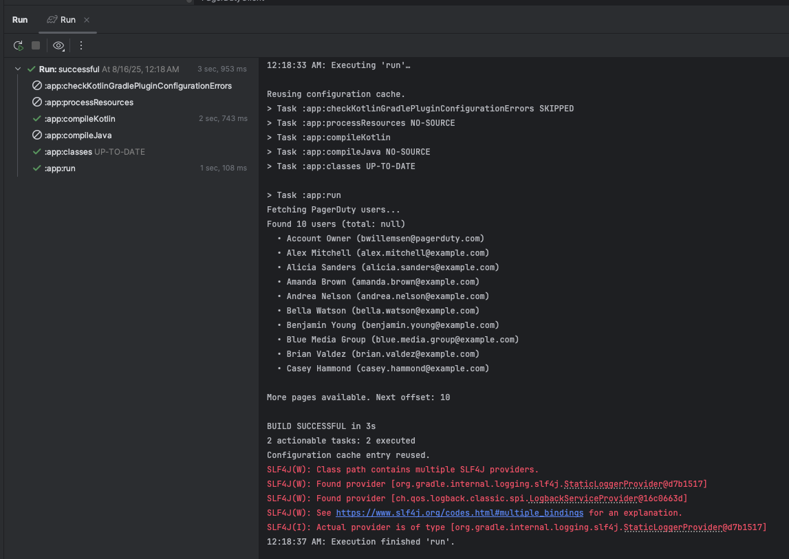
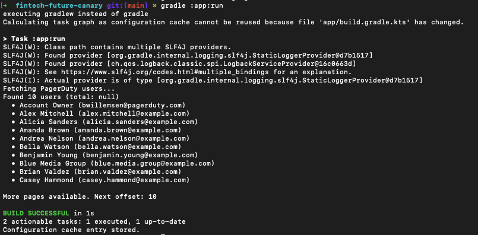

# FinTech `future` Canary

More appropriately, present-time Canary.

Why does this repo exist?

Recently I was asked to make a pure-Java paging API consumer in 10 minutes.

As requested, I implemented the pagination using bare Java HttpClient. <br/> 
However, I was asked for **'production quality code like I would produce for a customer,'** <br/>
I felt obligated to also show what I would actually deliver in production: [Kotlin/Ktor variant](https://github.com/Mimis-Latlaeg-Hattalag/fintech-future-canary "The Canary should be provided adequate engineering competence"). 

The Java version took ~5 hours and has numerous production concerns (see [README](https://github.com/Mimis-Latlaeg-Hattalag/fintech-canary/blob/main/README.md)).<br/>
The Kotlin version took 30 minutes and is _**actually production-ready**_.

## Key Features and Benefits

- Kotlin Data Classes are a far superior alternative to POJOs.
- [The BOMB! - `PagerDutyClient`](https://github.com/Mimis-Latlaeg-Hattalag/fintech-future-canary/blob/main/app/src/main/kotlin/me/riddle/fintech/client/PagerDutyClient.kt) - production-ready in just ~40 lines of code!
- That's it! - just a main class to demonstrate usage.

## The BEST Part?!

**There is NOTHING to test!**

Java introduces a lot of boilerplate custom code for common concerns.

ALL of these are handled by the Ktor Client library and Kotlin elegance. <br/>
Oh, and did I mention, it's **coroutines-based** - GoLang can't match this performance.

In the production system we would add tests, but those are for the business logic using this transporter.

## RUNNING THE CANARY

**IMPORTANT:** `PAGERDUTY_API_TOKEN=<YOUR_TOKEN>` <- set this environment variable (go [here](https://developer.pagerduty.com/)).

```bash
 ./gradlew :app:run
```

## IntelliJ IDEA Bug - IMPORTANT

I am using Gradle 9 and IDEA with create a bad RunConfig for you.<br/>
So, I checked in one I rolled by hand for your convenience.

## Appearance:

**IDEA Run:**



**Gradle Run:**

